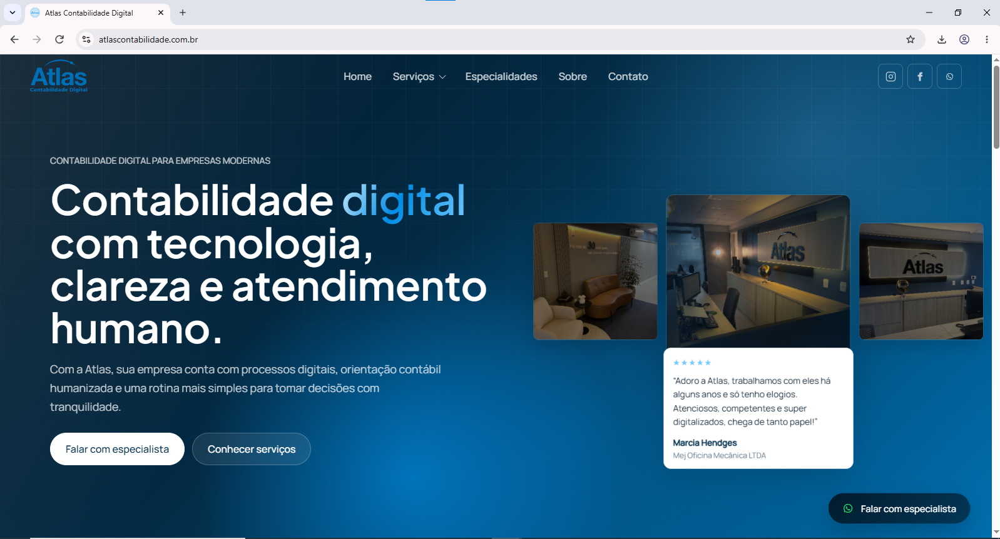
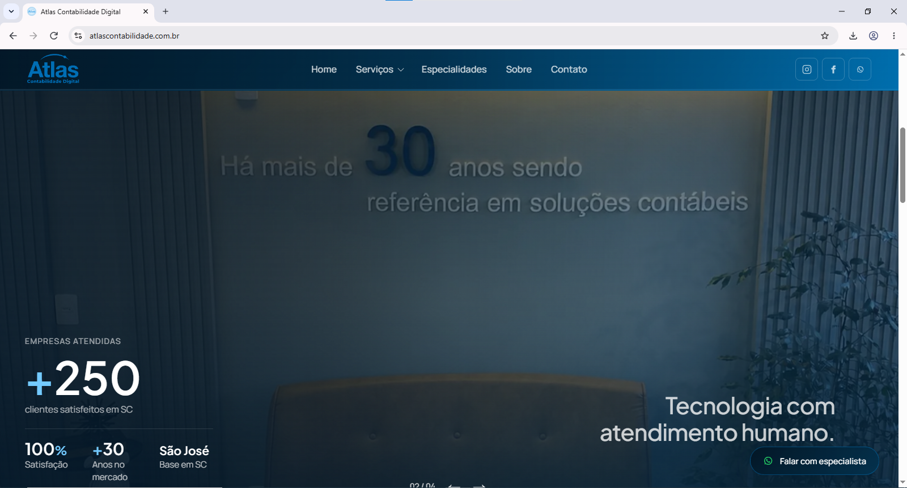
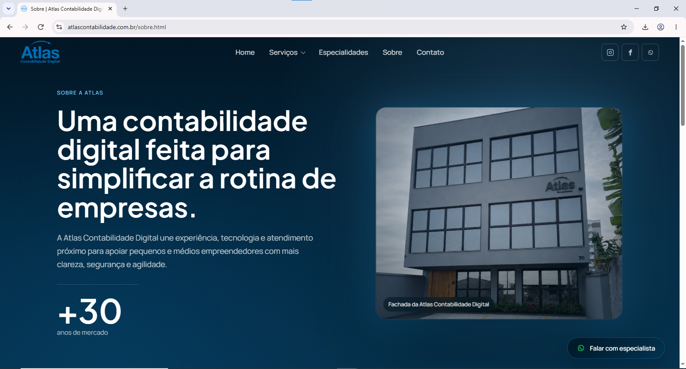
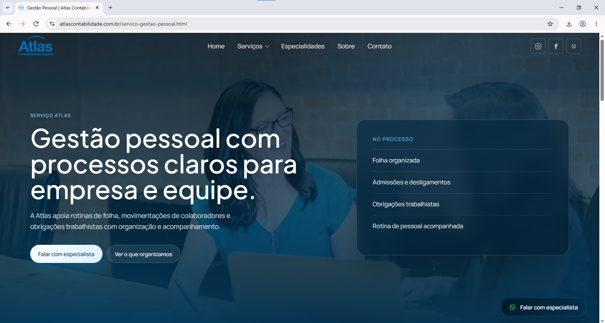
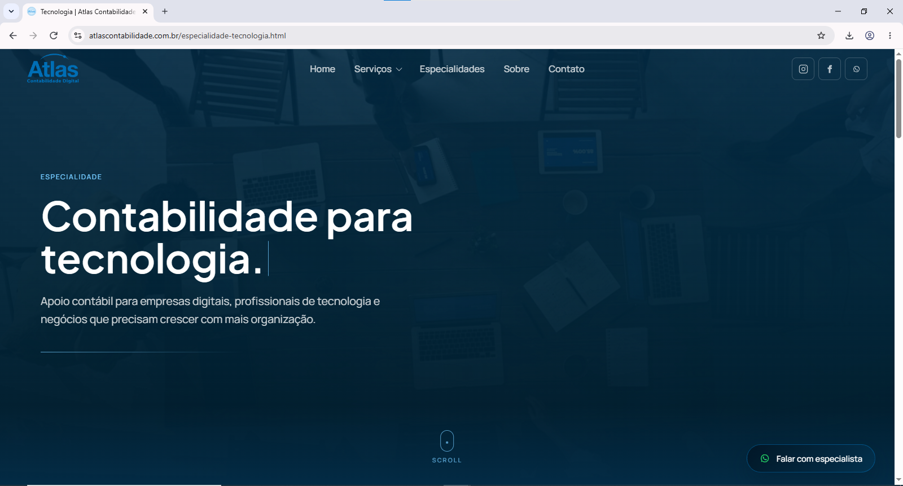
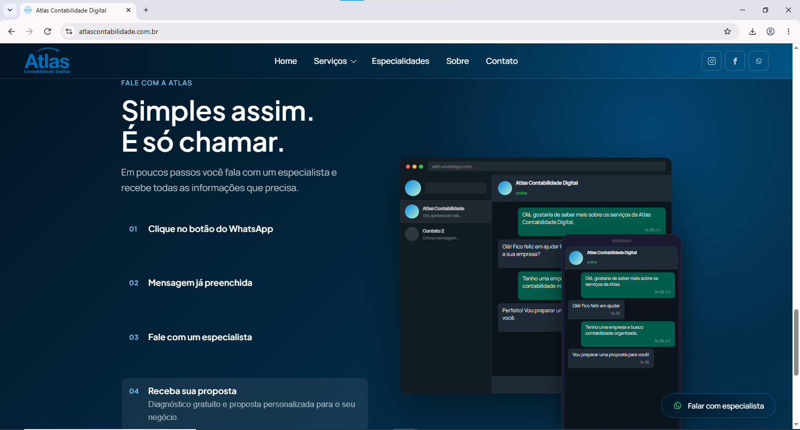

# Atlas Contabilidade Digital

Site institucional desenvolvido para a **Atlas Contabilidade Digital**, com foco em apresentar a empresa, seus serviços, especialidades e diferenciais de forma clara, moderna e profissional.

🌐 **Site em produção:** [atlascontabilidade.com.br](https://atlascontabilidade.com.br)

---

## Sobre o projeto

O projeto consiste no desenvolvimento do site institucional da Atlas Contabilidade Digital.

A aplicação foi construída com **HTML, CSS e JavaScript puro**, sem utilização de frameworks, e conta com página inicial, páginas internas de serviços e especialidades, área institucional, integração com WhatsApp e conteúdo adaptado para diferentes tamanhos de tela.

A proposta visual foi desenvolvida buscando transmitir credibilidade, organização, modernidade e proximidade, mantendo a navegação simples e objetiva.

O projeto foi desenvolvido para uso real e atualmente está publicado no domínio oficial da empresa.

---

## Status do projeto

✅ **Concluído e publicado em produção.**

O site está disponível em:

**https://atlascontabilidade.com.br**

O desenvolvimento principal foi finalizado, permanecendo possíveis evoluções futuras relacionadas a SEO, acessibilidade, performance e novas funcionalidades.

---

## Preview

### Página inicial

<p align="center">
  
</p>

### Seções institucionais

<table>
  <tr>
    <td align="center">
      
    </td>
    <td align="center">
      
    </td>
  </tr>
</table>

### Serviços e especialidades

<table>
  <tr>
    <td align="center">
      
    </td>
    <td align="center">
      
    </td>
  </tr>
</table>

### Componentes da interface

<table>
  <tr>
    <td align="center">
      
    </td>
    <td align="center">
      
    </td>
  </tr>
</table>

### Contato

<p align="center">
  
</p>

---

## Links

🌐 **Site:** [atlascontabilidade.com.br](https://atlascontabilidade.com.br)

💻 **Repositório:** [github.com/LuanPereiradaCosta/landingpage_atlas](https://github.com/LuanPereiradaCosta/landingpage_atlas)

---

## Tecnologias utilizadas

- HTML5
- CSS3
- JavaScript
- Manipulação do DOM
- CSS Grid
- Flexbox
- Media Queries
- Animações e transições com CSS
- Imagens otimizadas em WebP

---

## Funcionalidades

- Header responsivo com navegação principal.
- Menu dropdown para serviços.
- Hero principal com carrossel visual.
- Área de avaliações e prova social.
- Seção institucional com imagens e informações da empresa.
- Seção de diferenciais.
- Carrossel de especialidades.
- Páginas individuais para serviços.
- Páginas individuais para especialidades.
- Página institucional Sobre.
- Integração para contato via WhatsApp.
- Footer compartilhado entre as páginas internas.
- Animações e transições em elementos da interface.
- Transições entre páginas.
- Imagens responsivas para desktop e dispositivos móveis.
- Imagens otimizadas em formato WebP.
- Página de política de privacidade.
- Página de política de qualidade.

---

## Páginas desenvolvidas

```text
index.html
sobre.html

servico-contabil-fiscal.html
servico-gestao-pessoal.html
servico-planejamento-tributario.html
servico-abertura-empresa.html
servico-migracao-contabilidade.html

especialidade-advocacia.html
especialidade-saude-bem-estar.html
especialidade-representantes-comerciais.html
especialidade-engenharia-arquitetura.html
especialidade-tecnologia.html
especialidade-corretor-imoveis.html

politica-de-privacidade.html
politica-de-qualidade.html
```

---

## Decisões de UI/UX

O visual do projeto foi desenvolvido buscando transmitir:

- confiança;
- clareza;
- modernidade;
- organização;
- profissionalismo;
- proximidade no atendimento.

Algumas das decisões aplicadas na interface incluem:

- paleta baseada em tons de azul, branco e elementos discretos;
- utilização de fotografias reais da empresa;
- overlays sobre imagens para preservar a legibilidade dos textos;
- tipografia limpa e adequada ao contexto corporativo;
- animações e transições suaves;
- CTAs direcionados para facilitar o contato;
- navegação objetiva entre serviços, especialidades e informações institucionais;
- adaptação dos enquadramentos das imagens entre desktop e dispositivos móveis.

---

## Responsividade

O site foi desenvolvido para funcionar em diferentes tamanhos de tela, incluindo:

- smartphones;
- tablets;
- notebooks;
- desktops;
- telas maiores.

Entre os recursos utilizados estão:

```css
clamp()
min()
max-width
grid
flex
media queries
```

Também foram utilizadas imagens específicas para determinados tamanhos de tela quando o enquadramento da versão desktop não oferecia uma boa experiência em dispositivos móveis.

---

## Acessibilidade

Durante o desenvolvimento foram aplicadas algumas práticas de acessibilidade, incluindo:

- utilização de HTML semântico;
- `aria-label` em elementos quando necessário;
- `aria-expanded` em componentes de navegação;
- imagens decorativas utilizando `alt=""`;
- textos compreensíveis nos links;
- preocupação com contraste entre texto e fundo;
- suporte à preferência por redução de movimento quando aplicável.

A acessibilidade ainda pode ser aprofundada futuramente por meio de testes específicos e validações com ferramentas especializadas.

---

## Otimização de imagens

As fotografias utilizadas no site passaram por organização e otimização antes da publicação.

Foram aplicadas práticas como:

- conversão para o formato WebP;
- redução do tamanho dos arquivos;
- remoção de imagens não utilizadas;
- separação de imagens para desktop e mobile quando necessário;
- ajustes de enquadramento;
- organização das imagens por contexto de utilização.

Essa organização contribui para reduzir o peso dos arquivos carregados pelo site e melhorar a experiência em diferentes dispositivos.

---

## Estrutura do projeto

```text
.
├── index.html
├── sobre.html
│
├── servico-*.html
├── especialidade-*.html
│
├── politica-de-privacidade.html
├── politica-de-qualidade.html
│
├── css/
│   └── style.css
│
├── js/
│   ├── script.js
│   └── layout.js
│
├── assets/
│   ├── empresas/
│   ├── especialidades/
│   ├── fotos_referencia/
│   │   ├── carrossel_especialidades.png
│   │   ├── contatos.png
│   │   ├── diferenciais_com_carrossel.png
│   │   ├── especialidades.png
│   │   ├── hero_home.png
│   │   ├── home_institucional.png
│   │   ├── servicos.png
│   │   └── sobre.png
│   ├── images/
│   │   ├── fachada/
│   │   ├── hero-home/
│   │   └── institucional/
│   └── logo/
│
└── README.md
```

---

## Como executar localmente

Clone o repositório:

```bash
git clone https://github.com/LuanPereiradaCosta/landingpage_atlas.git
```

Acesse a pasta do projeto:

```bash
cd landingpage_atlas
```

Depois, abra o arquivo `index.html` diretamente no navegador ou utilize uma ferramenta como o **Live Server** no VS Code.

Como o projeto utiliza apenas HTML, CSS e JavaScript no frontend, não é necessário instalar dependências para executá-lo localmente.

---

## Aprendizados

Este projeto permitiu aplicar conhecimentos de desenvolvimento web em um cenário real de uso.

Entre os principais aprendizados trabalhados durante o desenvolvimento estão:

- estruturação de um site institucional com múltiplas páginas;
- organização de arquivos e componentes de um projeto web;
- desenvolvimento de interfaces responsivas;
- utilização de CSS Grid e Flexbox;
- criação de animações e transições com CSS;
- desenvolvimento de carrosséis e elementos interativos com JavaScript;
- manipulação de elementos e classes do DOM;
- criação e reutilização de elementos de layout entre páginas;
- adaptação de interfaces para dispositivos móveis;
- otimização e organização de imagens para web;
- aplicação de práticas iniciais de acessibilidade;
- organização da navegação e dos CTAs;
- documentação de um projeto;
- preparação e publicação de um site em ambiente de produção;
- manutenção de um projeto utilizado por uma empresa real.

---

## Possíveis evoluções

O site está concluído e publicado, mas poderá continuar evoluindo conforme as necessidades da empresa.

Algumas possibilidades são:

- aprofundamento das estratégias de SEO;
- realização de testes mais completos de acessibilidade;
- acompanhamento e otimização de performance;
- testes adicionais entre navegadores e dispositivos;
- integração de formulário de contato com backend;
- criação de área de conteúdos ou blog;
- implementação de ferramentas de análise de navegação e conversão.

---

## Autor

Desenvolvido por **Luan Pereira da Costa**.

[GitHub](https://github.com/LuanPereiradaCosta) • [LinkedIn](https://www.linkedin.com/in/luan-pereira-da-costa-333b433b0/)